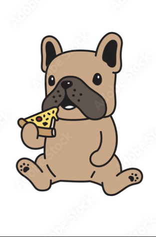
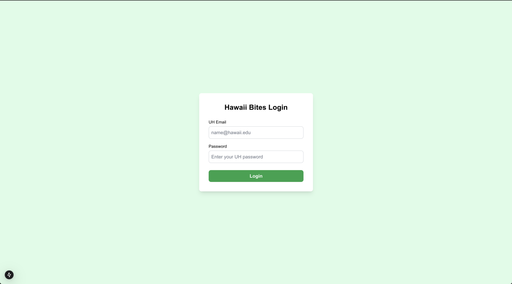
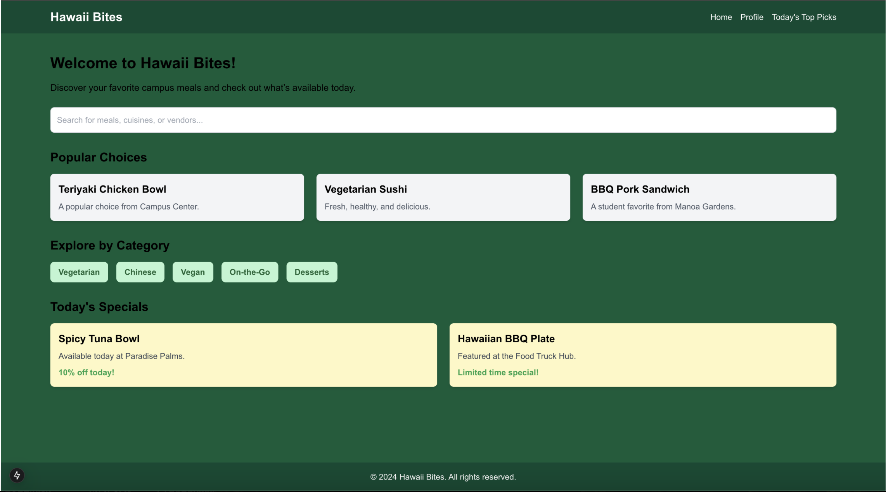
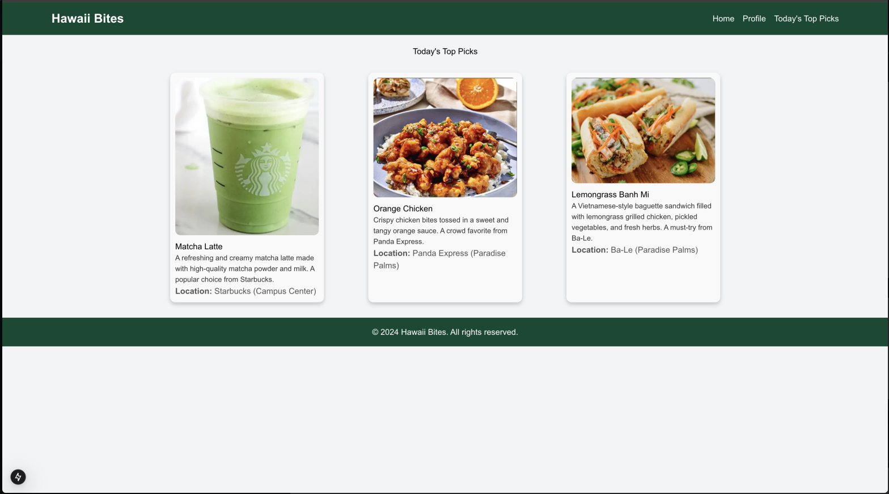
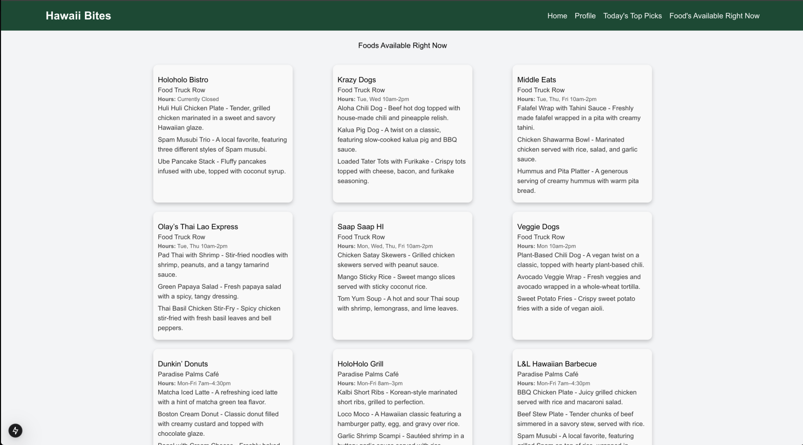
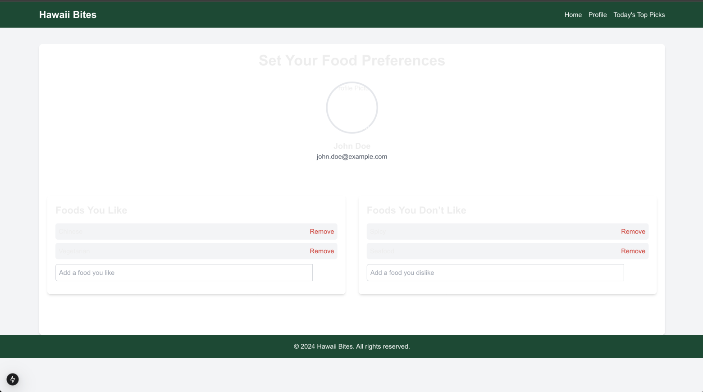
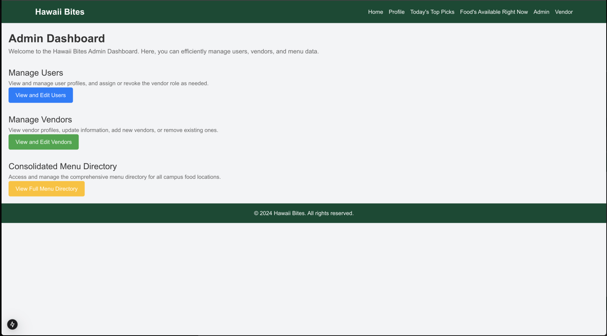
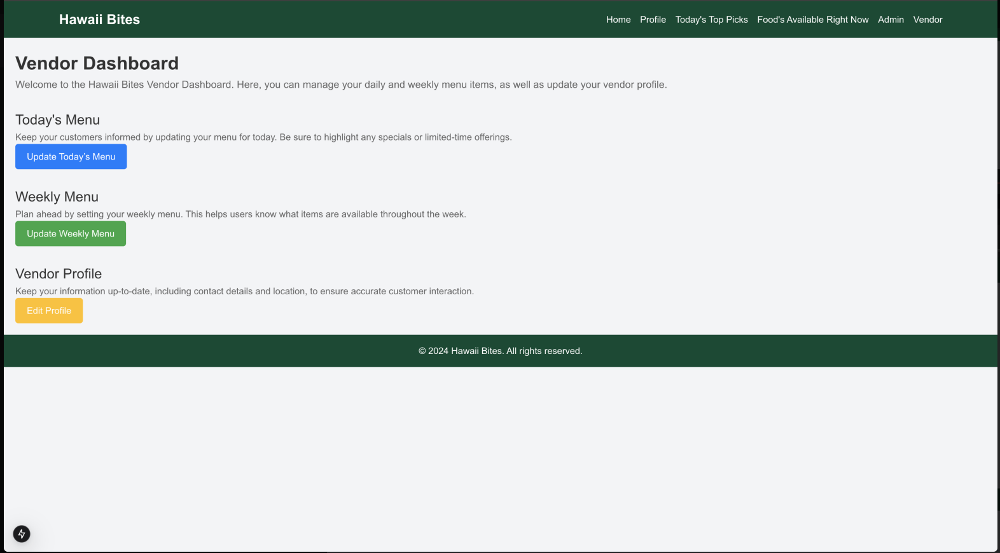
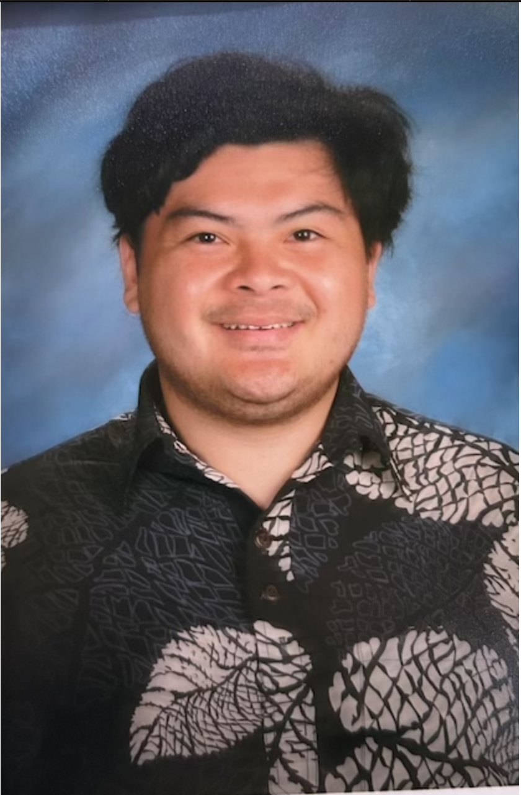

<<<<<<< HEAD
<<<<<<< HEAD
<<<<<<< HEAD
<!-- Navigation Tabs -->
<<<<<<< HEAD
<nav style="background-color: #f8f9fa; padding: 15px; border-bottom: 2px solid #ddd; margin-bottom: 20px;">
  <ul style="list-style: none; display: flex; justify-content: center; margin: 0; padding: 0; gap: 30px;">
    <li><a href="index.html" style="text-decoration: none; font-weight: bold; color: #8B0000; font-size: 1.1em;">Home</a></li>
    <li><a href="screenshots.html" style="text-decoration: none; font-weight: bold; color: #8B0000; font-size: 1.1em;">Progress</a></li>
    <li><a href="meet-the-team.html" style="text-decoration: none; font-weight: bold; color: #8B0000; font-size: 1.1em;">Meet the Team - Woof!</a></li>
    <li><a href="project-links.html" style="text-decoration: none; font-weight: bold; color: #8B0000; font-size: 1.1em;">Project Links</a></li>
=======
<nav style="background-color: #f8f9fa; padding: 10px; border-bottom: 1px solid #ddd;">
  <ul style="list-style: none; display: flex; justify-content: center; margin: 0; padding: 0; gap: 20px;">
<<<<<<< HEAD
<<<<<<< HEAD
<<<<<<< HEAD
    <li><a href="index.html" style="text-decoration: none; font-weight: bold; color: #065f46;">Home</a></li>
    <li><a href="screenshots.html" style="text-decoration: none; font-weight: bold; color: #065f46;">Screenshots of Progress</a></li>
>>>>>>> parent of 9f5107d (Update index.md)
=======
    <li><a href="index.html" style="text-decoration: none; font-weight: bold; color: #0000CD;">Home</a></li>
    <li><a href="screenshots.html" style="text-decoration: none; font-weight: bold; color: #0000CD;">Progress</a></li>
>>>>>>> parent of ceb4f9d (Update index.md)
=======
    <li><a href="index.html" style="text-decoration: none; font-weight: bold; color: #ADD8E6;">Home</a></li>
    <li><a href="screenshots.html" style="text-decoration: none; font-weight: bold; color: #ADD8E6;">Progress</a></li>
    <li><a href="meet-the-team.html" style="text-decoration: none; font-weight: bold; color: #ADD8E6;">Meet the Team - Woof!</a></li>
>>>>>>> parent of 3cd44ac (Update index.md)
=======
    <li><a href="index.html" style="text-decoration: none; font-weight: bold; color: #8B0000;">Home</a></li>
    <li><a href="screenshots.html" style="text-decoration: none; font-weight: bold; color: #8B0000;">Progress</a></li>
    <li><a href="meet-the-team.html" style="text-decoration: none; font-weight: bold; color: #8B0000;">Meet the Team - Woof!</a></li>
>>>>>>> parent of 645bbae (Update index.md)
  </ul>
</nav>
=======
# Manoa Munchies
=======
Welcome to Manoa Munchies! This app helps students find their favorite meals on campus.
>>>>>>> parent of 07b430d (Update index.md)

<<<<<<< HEAD
Welcome to Manoa Munchies! This app helps students find their favorite meals on campus.
>>>>>>> parent of 47696c1 (Update index.md)

<<<<<<< HEAD
<!-- Page Header -->
<header style="display: flex; align-items: center; justify-content: center; margin-top: 20px;">
  
  <h1 style="color: #8B0000; font-size: 2.5em; font-family: 'Arial', sans-serif; margin: 0;">Hawaii Bites</h1>
</header>

Helping students find their favorite meals on campus.

=======
=======
=======
>>>>>>> parent of 978552a (fix to Hawaii Bites)
title: Hawaii Bites
=======
>>>>>>> parent of 1600cc1 (Delete index.md)
---

=======
>>>>>>> parent of b6f1830 (Update index.md)
=======
<!-- Page Content -->
>>>>>>> parent of 645bbae (Update index.md)
Welcome to Hawaii Bites! This app helps students find their favorite meals on campus.

<<<<<<< HEAD
>>>>>>> parent of 80994c8 (Delete index.md)
## Navigation
- [Overview](#overview)
<<<<<<< HEAD
- [User Guide](#user-guide)
- [Developer Guide](#developer-guide)
- [Contact Us](#contact-us)
<<<<<<< HEAD
<<<<<<< HEAD
>>>>>>> parent of e512910 (Update index.md)
=======
- - [Overview](#overview)
>>>>>>> parent of 6baa6bf (Update index.md)

<<<<<<< HEAD
<<<<<<< HEAD
<!-- Page Content -->
<section style="max-width: 800px; margin: 0 auto; font-size: 1em; line-height: 1.6;">
  <h2 style="border-bottom: 2px solid #ddd; padding-bottom: 10px; color: #8B0000;">Navigation</h2>
  <ul style="list-style: none; padding: 0; margin-bottom: 30px;">
    <li><a href="#overview" style="text-decoration: none; color: #065f46; font-weight: bold;">Overview</a></li>
    <li><a href="#project-goals" style="text-decoration: none; color: #065f46; font-weight: bold;">Project Goals</a></li>
    <li><a href="#user-guide" style="text-decoration: none; color: #065f46; font-weight: bold;">User Guide</a></li>
    <li><a href="#developer-guide" style="text-decoration: none; color: #065f46; font-weight: bold;">Developer Guide</a></li>
    <li><a href="#contact-us" style="text-decoration: none; color: #065f46; font-weight: bold;">Contact Us</a></li>
  </ul>
=======
## Overview
<<<<<<< HEAD
Manoa Munchies provides a consolidated menu from all food vendors at the University of Hawaii, including food trucks, Campus Center, and Paradise Palms.
>>>>>>> parent of 07b430d (Update index.md)

<<<<<<< HEAD
  <h2 id="overview" style="border-bottom: 2px solid #ddd; padding-bottom: 10px; color: #8B0000;">Overview</h2>
  

    Hawaii Bites provides a consolidated menu from all food vendors at the University of Hawaii, including food trucks, Campus Center, and Paradise Palms.
  

=======
=======
Hawaii Bites provides a consolidated menu from all food vendors at the University of Hawaii, including food trucks, Campus Center, and Paradise Palms.

>>>>>>> parent of 105d31f (Update index.md)
## User Guide
- Navigate to "Foods Available Now" to see what’s being served.
<<<<<<< HEAD
- Use filters to search for specific cuisines or dietary preferences.
=======
- 
>>>>>>> parent of 9cd6519 (update index)
=======

=======
>>>>>>> parent of 16c77f5 (Update index.md)
=======
## Navigation
- [Overview](#overview)
=======
>>>>>>> parent of b1a6952 (Update index.md)
- [Project Mockups](#project-mockups)
- [Project Goals](#project-goals)
- [User Guide](#user-guide)
- [Developer Guide](#developer-guide)
- [Meet the Team](#meet-the-team)
<<<<<<< HEAD
<<<<<<< HEAD
=======
- [Team Contract](#team-contract)
>>>>>>> parent of f152bd2 (Update index.md)
=======
- [Team Contract](#team-contract)
- [Project Management](#project-management)
>>>>>>> parent of ceb4f9d (Update index.md)
- [Contact Us](#contact-us)

 

<<<<<<< HEAD
>>>>>>> parent of 1600cc1 (Delete index.md)
=======
>>>>>>> parent of b6f1830 (Update index.md)
## Overview
Hawaii Bites provides a consolidated menu from all food vendors at the University of Hawaii, including food trucks, Campus Center, and Paradise Palms.

<<<<<<< HEAD

<<<<<<< HEAD
<<<<<<< HEAD
<<<<<<< HEAD
<<<<<<< HEAD
=======
# Project Mockups
=======
# Project Pages Overview
>>>>>>> parent of 16c77f5 (Update index.md)

  <!-- Column 1: Landing Page -->
  

    <h2>Landing Page</h2>
    
    

=======
=======
>>>>>>> parent of b6f1830 (Update index.md)
=======
>>>>>>> parent of b1a6952 (Update index.md)
# Project Mockups

  <!-- Landing Page -->
  

    <h2>Landing Page</h2>
    
    

<<<<<<< HEAD
>>>>>>> parent of 1600cc1 (Delete index.md)
=======
>>>>>>> parent of b1a6952 (Update index.md)
      The first look at Hawaii Bites, giving users an overview of the app's features and inviting them to explore the best food options on campus.
    

  

<<<<<<< HEAD
<<<<<<< HEAD
  <!-- Column 2: Home Page -->
  

    <h2>Home Page</h2>
    
    

=======
=======
>>>>>>> parent of b1a6952 (Update index.md)
  <!-- Home Page -->
  

    <h2>Home Page</h2>
    
    

<<<<<<< HEAD
>>>>>>> parent of 1600cc1 (Delete index.md)
=======
>>>>>>> parent of b1a6952 (Update index.md)
      The main hub for users, showcasing popular food options, daily specials, and easy access to different sections of the app.
    

  

<<<<<<< HEAD
<<<<<<< HEAD
<<<<<<< HEAD
  <!-- Column 3: Today's Top Picks Page -->
  

    <h2>Today's Top Picks</h2>
    
    

=======
=======
>>>>>>> parent of b6f1830 (Update index.md)
  <!-- Today's Top Picks Page -->
  

    <h2>Today's Top Picks</h2>
    
    

<<<<<<< HEAD
>>>>>>> parent of 1600cc1 (Delete index.md)
=======
>>>>>>> parent of b6f1830 (Update index.md)
      Highlighting the most popular and trending food items for the day, curated based on user preferences and vendor updates.
    

  

<<<<<<< HEAD
<<<<<<< HEAD
  <!-- Column 4: Foods Available Right Now Page -->
  

    <h2>Foods Available Right Now</h2>
    
    

=======
=======
>>>>>>> parent of b6f1830 (Update index.md)
  <!-- Foods Available Right Now Page -->
  

    <h2>Foods Available Right Now</h2>
    
    

<<<<<<< HEAD
>>>>>>> parent of 1600cc1 (Delete index.md)
=======
>>>>>>> parent of b6f1830 (Update index.md)
      A live feed of all food options currently available on campus, updated in real-time to help users find meals instantly.
    

  

<<<<<<< HEAD
<<<<<<< HEAD
  <!-- Column 5: User Profile Page -->
  

    <h2>User Profile</h2>
    
    

=======
=======
>>>>>>> parent of b6f1830 (Update index.md)
  <!-- User Profile Page -->
  

    <h2>User Profile</h2>
    
    

<<<<<<< HEAD
>>>>>>> parent of 1600cc1 (Delete index.md)
=======
>>>>>>> parent of b6f1830 (Update index.md)
      Personalized user profile page where users can set their preferences, dietary restrictions, and save favorite food items.
    

  

<<<<<<< HEAD
=======
  <!-- Admin Dashboard Page -->

  <h2>Admin Dashboard</h2>
  
  

    The Admin Dashboard provides comprehensive tools for managing the Hawaii Bites application. Admins can view and edit user profiles, manage vendor information, and maintain the consolidated menu directory. It ensures smooth operation and seamless user experience.
  

  <ul style="text-align: left; margin-top: 10px;">
    <li><strong>Manage Users:</strong> View, update, and control user access, including assigning or revoking vendor roles.</li>
    <li><strong>Manage Vendors:</strong> Edit vendor profiles, add new vendors, and oversee existing vendor listings.</li>
    <li><strong>Consolidated Menu Directory:</strong> Access the complete menu directory for all campus food locations and make necessary updates.</li>
  </ul>
>>>>>>> parent of b6f1830 (Update index.md)

<<<<<<< HEAD
>>>>>>> parent of fe4e272 (Update index.md)
=======
>>>>>>> parent of 1600cc1 (Delete index.md)

<!-- Vendor Dashboard Page -->

  <h2>Vendor Dashboard</h2>
  
  

    The Vendor Dashboard allows food vendors to manage their menu offerings and update their profile information. This dashboard helps vendors stay connected with customers and provide real-time updates on available items.
  

  <ul style="text-align: left; margin-top: 10px;">
    <li><strong>Today's Menu:</strong> Quickly update the menu items available for the current day, highlighting any specials.</li>
    <li><strong>Weekly Menu:</strong> Plan and set the weekly menu, giving users a preview of upcoming offerings.</li>
    <li><strong>Vendor Profile:</strong> Keep vendor information up-to-date, including contact details and location, for accurate customer interaction.</li>
  </ul>

=======

>>>>>>> parent of b1a6952 (Update index.md)
## Project Goals
1. Consolidate Campus Food Options: Provide a single platform that lists menu items from all University of Hawaii campus food locations, including Campus Center, food trucks, Manoa Gardens, and Paradise Palms.
2. Real-Time Menu Updates: Offer up-to-date information on what food items are available today, including daily specials and limited-time offerings.
3. Personalized Food Recommendations: Allow users to set preferences for specific cuisines (e.g., vegan, gluten-free, ethnic foods) and receive tailored suggestions based on their choices.
4. Vendor Collaboration: Enable vendors to update their menu options directly, ensuring accurate and current food availability data.
5. Enhanced User Experience: Help users quickly find the type of food they crave and discover popular dishes or trending items on campus.
6. Community Engagement: Allow users to rate food items and provide feedback, creating a community-driven guide to the best eats on campus.

## User Guide
- Navigate through the Welcome Page to see what’s being served.
- Filter through foods according to what your preferences is.
- Get updates on Specials and Top Picks
<<<<<<< HEAD
>>>>>>> parent of 80994c8 (Delete index.md)
=======
>>>>>>> parent of 1600cc1 (Delete index.md)

## Developer Guide
To run this project locally:
1. Clone the repository.
2. Install dependencies using `npm install`.
3. Run the app with `npm run dev`.

<<<<<<< HEAD
<<<<<<< HEAD
<<<<<<< HEAD
<<<<<<< HEAD
## Team Members
# Kanoa Borromeo
- Dominic “Kanoa” Borromeo is a rising senior, majoring in Computer Science at UH Manoa. Stepping away from D1 soccer in California allowed Kanoa to immerse himself in AI-related opportunities. Kanoa aspires to combine his CS and future JD degrees to help regulate AI policies.

# Seth Ines
- Seth Ines is pursuing a Bachelor of Science in Computer Science within the Department of Information and Computer Sciences at the University of Hawaii. His career goal is to become a data analysis engineer, applying analytical and technical expertise to solve complex data challenges.
>>>>>>> parent of 4399e46 (Update index.md)
=======
# Meet the Team
## Kanoa Borromeo
<<<<<<< HEAD
<<<<<<< HEAD
<<<<<<< HEAD
<<<<<<< HEAD
- Dominic “Kanoa” Borromeo is a rising senior, majoring in Computer Science at UH Manoa. Stepping away from D1 soccer in California allowed Kanoa to immerse himself in AI-related opportunities. Kanoa aspires to combine his CS and future JD degrees to help regulate AI policies.
=======

=======

>>>>>>> parent of 162e9a3 (Update index.md)
=======

>>>>>>> parent of 408a329 (Update index.md)
=======

>>>>>>> parent of af8a863 (Update index.md)

<<<<<<< HEAD
Dominic “Kanoa” Borromeo is a rising senior, majoring in Computer Science at UH Manoa. Stepping away from D1 soccer in California allowed Kanoa to immerse himself in AI-related opportunities. Kanoa aspires to combine his CS and future JD degrees to help regulate AI policies.
>>>>>>> parent of f4ecb8f (Update index.md)

## Seth Ines
<<<<<<< HEAD
<<<<<<< HEAD
<<<<<<< HEAD
- Seth Ines is pursuing a Bachelor of Science in Computer Science within the Department of Information and Computer Sciences at the University of Hawaii. His career goal is to become a data analysis engineer, applying analytical and technical expertise to solve complex data challenges.
>>>>>>> parent of aff6640 (Update index.md)
=======

=======

>>>>>>> parent of 408a329 (Update index.md)
=======

>>>>>>> parent of af8a863 (Update index.md)
=======
## Kanoa Borromeo

Dominic “Kanoa” Borromeo is a rising senior, majoring in Computer Science at UH Manoa. Stepping away from D1 soccer in California allowed Kanoa to immerse himself in AI-related opportunities. Kanoa aspires to combine his CS and future JD degrees to help regulate AI policies.

## Seth Ines

>>>>>>> parent of 479c5ac (Update index.md)

Seth Ines is pursuing a Bachelor of Science in Computer Science within the Department of Information and Computer Sciences at the University of Hawaii. His career goal is to become a data analysis engineer, applying analytical and technical expertise to solve complex data challenges.

>>>>>>> parent of 162e9a3 (Update index.md)

  <h2 id="project-goals" style="border-bottom: 2px solid #ddd; padding-bottom: 10px; color: #8B0000;">Project Goals</h2>
  <ul style="margin-bottom: 30px;">
    <li>Consolidate Campus Food Options: Provide a single platform that lists menu items from all University of Hawaii campus food locations, including Campus Center, food trucks, Manoa Gardens, and Paradise Palms.</li>
    <li>Real-Time Menu Updates: Offer up-to-date information on what food items are available today, including daily specials and limited-time offerings.</li>
    <li>Personalized Food Recommendations: Allow users to set preferences for specific cuisines (e.g., vegan, gluten-free, ethnic foods) and receive tailored suggestions based on their choices.</li>
    <li>Vendor Collaboration: Enable vendors to update their menu options directly, ensuring accurate and current food availability data.</li>
    <li>Enhanced User Experience: Help users quickly find the type of food they crave and discover popular dishes or trending items on campus.</li>
    <li>Community Engagement: Allow users to rate food items and provide feedback, creating a community-driven guide to the best eats on campus.</li>
  </ul>

<<<<<<< HEAD
  <h2 id="user-guide" style="border-bottom: 2px solid #ddd; padding-bottom: 10px; color: #8B0000;">User Guide</h2>
  <ul style="margin-bottom: 30px;">
    <li>Navigate through the Welcome Page to see what’s being served.</li>
    <li>Filter through foods according to your preferences.</li>
    <li>Get updates on Specials and Top Picks.</li>
  </ul>

<<<<<<< HEAD
  <h2 id="developer-guide" style="border-bottom: 2px solid #ddd; padding-bottom: 10px; color: #8B0000;">Developer Guide</h2>
  <ol style="margin-bottom: 30px;">
    <li>Clone the repository.</li>
    <li>Install dependencies using <code>npm install</code>.</li>
    <li>Run the app with <code>npm run dev</code>.</li>
  </ol>

  <h2 id="contact-us" style="border-bottom: 2px solid #ddd; padding-bottom: 10px; color: #8B0000;">Contact Us</h2>
  <ul>
    <li>Email: <a href="mailto:hawaiibites@gmail.com" style="text-decoration: none; color: #065f46;">hawaiibites@gmail.com</a></li>
    <li>GitHub: <a href="https://github.com/hawaii-bites/hawaii-bites.github.io" style="text-decoration: none; color: #065f46;">Hawaii Bites Organization</a></li>
  </ul>
</section>
=======
=======
>>>>>>> parent of 162e9a3 (Update index.md)
## Contact Us
<<<<<<< HEAD
- Email: **manoamunchiesuh@gmail.com**
- GitHub: [Manoa Munchies Organization](https://github.com/manoa-munchies)
>>>>>>> parent of e512910 (Update index.md)
=======
- Email: **hawaiibites@gmail.com**
- GitHub: [Manoa Munchies Organization](https://github.com/manoa-munchies)
>>>>>>> parent of 9cd6519 (update index)
=======
=======
>>>>>>> parent of 1600cc1 (Delete index.md)
=======
>>>>>>> parent of ceb4f9d (Update index.md)
# Meet the Team

  <!-- Column 1: Kanoa Borromeo -->
  

    <h2>Kanoa Borromeo</h2>
    
    

      Dominic “Kanoa” Borromeo is a rising senior, majoring in Computer Science at UH Manoa. Stepping away from D1 soccer in California allowed Kanoa to immerse himself in AI-related opportunities. Kanoa aspires to combine his CS and future JD degrees to help regulate AI policies.
    

  

  <!-- Column 2: Seth Ines -->
  

    <h2>Seth Ines</h2>
    
    

      Seth Ines is pursuing a Bachelor of Science in Computer Science within the Department of Information and Computer Sciences at the University of Hawaii. His career goal is to become a data analysis engineer, applying analytical and technical expertise to solve complex data challenges.
    

  

<<<<<<< HEAD
<<<<<<< HEAD
=======

## Team Contract
Hawaii Bites Team Contract
Team Members:

Kanoa Borromeo
Seth Ines
Project: Hawaii Bites (ICS 314 Fall 2024)

Objective: This contract outlines our team’s commitments, responsibilities, and communication plan to ensure a productive and efficient collaboration on the Hawaii Bites project.

1. Meeting Schedule
In-Person Meetings: We will meet every Tuesday and Thursday after ICS 314 class to discuss project updates, plan tasks, and address any challenges.
Check-in on Discord: We will have nightly check-ins on Discord at 9 PM HST to provide progress updates, ask questions, and coordinate any additional work that needs to be completed.
2. Task Distribution
We will use GitHub Issues and the project board to manage tasks. Each task will be assigned to one of us, and we will work in branches named according to the issue (e.g., issue-XX).
Tasks will be divided equally based on complexity and time commitment. Kanoa will focus on setting up the GitHub project board, managing deployments, and UI mockups. Seth will focus on initial deployment, setting up the landing page, and assisting with backend components.
Any additional tasks will be discussed during our check-ins, and workload adjustments will be made as needed to ensure fairness.
3. Communication Plan
Primary communication will be through Discord for quick updates and questions.
For more detailed discussions, we will use GitHub Issues and comments to document progress and any changes made to the project.
If any issues or conflicts arise, we will address them immediately during our nightly check-ins to prevent delays.
4. Work Quality and Deadlines
Both team members agree to complete their assigned tasks according to the deadlines set in the GitHub Project Board.
We will adhere to the ICS 314 course guidelines, including Issue-Driven Project Management (IDPM) practices, to ensure consistent progress and high-quality work.
5. Code Review and Merging
All work will be done in separate branches linked to GitHub Issues.
Each branch will be reviewed by the other team member before merging into the main branch to ensure code quality and prevent conflicts.
6. Conflict Resolution
If any disagreements arise regarding task assignment or project direction, we will resolve them during our in-person meetings or, if needed, escalate the issue to our course instructor for guidance.

## Project Management Links
>>>>>>> parent of b6f1830 (Update index.md)

## GitHub Hosting
The project adheres to GitHub hosting guidelines, ensuring proper issue management, version control, and branch protection practices.

=======
## Project Management
>>>>>>> parent of ceb4f9d (Update index.md)

## Contact Us
- Email: **hawaiibites@gmail.com**
<<<<<<< HEAD
<<<<<<< HEAD
- GitHub: [Hawaii Bites Organization](https://github.com/hawaii-bites)
<<<<<<< HEAD
>>>>>>> parent of 80994c8 (Delete index.md)
=======
>>>>>>> parent of 3452f76 (update index)
=======
- GitHub: [Hawaii Bites Organization](https://github.com/hawaii-bites/hawaii-bites.github.io)
>>>>>>> parent of 1600cc1 (Delete index.md)
=======
- GitHub: [Hawaii Bites Organization](https://github.com/hawaii-bites/hawaii-bites-project.github.io)
>>>>>>> parent of 8324444 (vendor and admin page)
